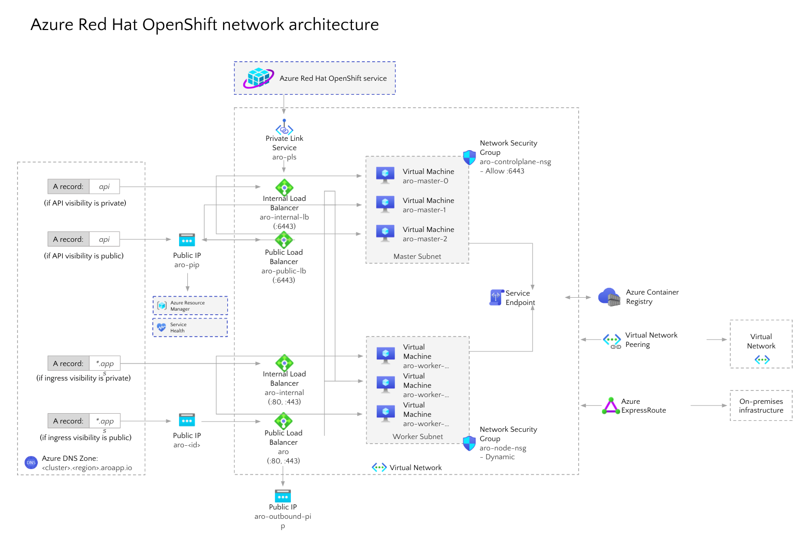

# Azure Red hat OpenShift Container Platform  Cloud Infrastructure Auomtation 
### - by Pranav Sharma, Principal Solutions Architect - DevOps Consulting
Ansible Playbook Module structure that configures a complete OpenShift 4.x Cluster latest version with complete configuration on Azure Cloud with all services  

## Architecture
### UseCase - Provisioning+Compliance+Automation+Orchrestration+Apps Deployment
 

### Following are the current feature set for a ARO Provisioning
1. Creating Resource group infrastructure on Azure Cloud
2. Creating required Virtual Network and Subnets for VMs
3. Creating Network Security Groups with required port allow/deny rules
4. Creating Internal and Public Load balancers
5. Creating Master and Worker Virtual Machines for OpenShift Cluster 
6. Creating Virtual Disks and attaching them to VMs as per layout defined
7. Creating Network Interfaces with Internal and Public IPAddresses
8. Creating Storage Account Required for Cluster and Image Registry
9. Creating Public IP Address resource and application subdomain for Apps access externally
10. Creating Storage Classes, Cluster API, Deploying Cluster resources for Alerting, Metrics and Monitoring
11. Near to 275 Containers with OpenShift default projects gets deployed
12. Dynamic Volume provisioning for persistent volumes configured through Azure Disks.
13. Deploys OpenShift WebConsole containers with User and Passwords to login to portal and is provided on execution screen towards completion of playbook.  

Pre-requisites:
1. Ansible v2.9 or later installed
2. Azure Cloud API or CLI Key Credentials embedded to system
## Preparations

1. Create a Ansible Creds file in `~/.azure/credentials` following below format:
```
[default]
subscription_id=<your-subscription_id>
client_id=<security-principal-appid>
secret=<security-principal-password>
tenant=<security-principal-tenant>
```
```
## Running the Installation
ansible-playbook site.yml
```
#git clone git@github.com:pranav-sharma429/ARO-azure_Redhat_Openshift.git
```

